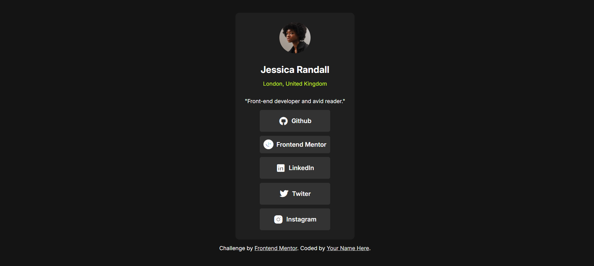
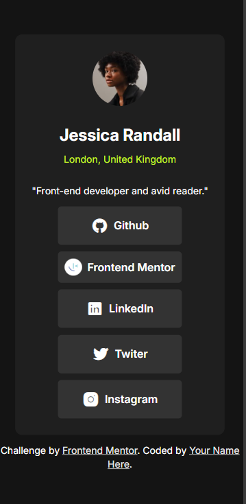
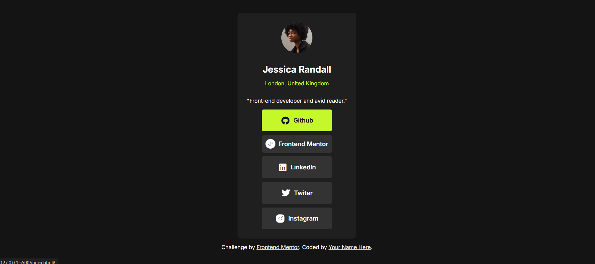

# Frontend Mentor - Social Links Profile Solution

This is my solution to the [Social Links Profile challenge on Frontend Mentor](https://www.frontendmentor.io/challenges/social-links-profile-UG32l9m6dQ). Frontend Mentor challenges help improve coding skills by building realistic projects. 

## Table of Contents

- [Overview](#overview)
  - [The Challenge](#the-challenge)
  - [Screenshot](#screenshot)
  - [Links](#links)
- [My Process](#my-process)
  - [Built With](#built-with)
  - [What I Learned](#what-i-learned)
  - [Continued Development](#continued-development)
  - [Useful Resources](#useful-resources)
- [Author](#author)
- [Acknowledgments](#acknowledgments)

## Overview

### The Challenge

Users should be able to:

- See hover and focus states for all interactive elements on the page.

### Screenshot





### Links

- [Solution URL](https://www.frontendmentor.io/solutions/a-responsive-social-links-profil-did-in-html-and-css-6NShSfeadK)
- [Live Site URL](https://github.com/NitiemaDev)

## My Process

### Built With

- Semantic HTML5 markup for structure.
- CSS custom properties for styling.
- Flexbox for layout.
- Media queries for responsive design.

### What I Learned

I learned how to import icons into my project using "Remixicon". Here's the CDN link for Remixicon. It's a bit long, but you don't need to memorize it!

```html
  <link rel="stylesheet" href="https://cdnjs.cloudflare.com/ajax/libs/remixicon/4.6.0/remixicon.css" integrity="sha512-kJlvECunwXftkPwyvHbclArO8wszgBGisiLeuDFwNM8ws+wKIw0sv1os3ClWZOcrEB2eRXULYUsm8OVRGJKwGA==" crossorigin="anonymous" referrerpolicy="no-referrer" />
```

After that, we can use icons like HTML text. That's really cool!

If you want more help with writing markdown, I recommend checking out [The Markdown Guide](https://www.markdownguide.org/) to learn more.

## Continued Development

In the future, I would like to add light and dark mode functionality.

## Useful Resources

- [Remixicon](https://remixicon.com/) - This helped me with importing icons into my project. I really liked this pattern and will use it going forward.
- [Google Fonts](https://fonts.google.com/) - This helped me with importing fonts into my project.

## Author

- GitHub - [Allassane Nitiema](https://github.com/NitiemaDev)
- Frontend Mentor - [@NitiemaDev](https://www.frontendmentor.io/profile/NitiemaDev)

## Acknowledgments

Thanks to Frontend Mentor for their challenges that help us improve our skills!
